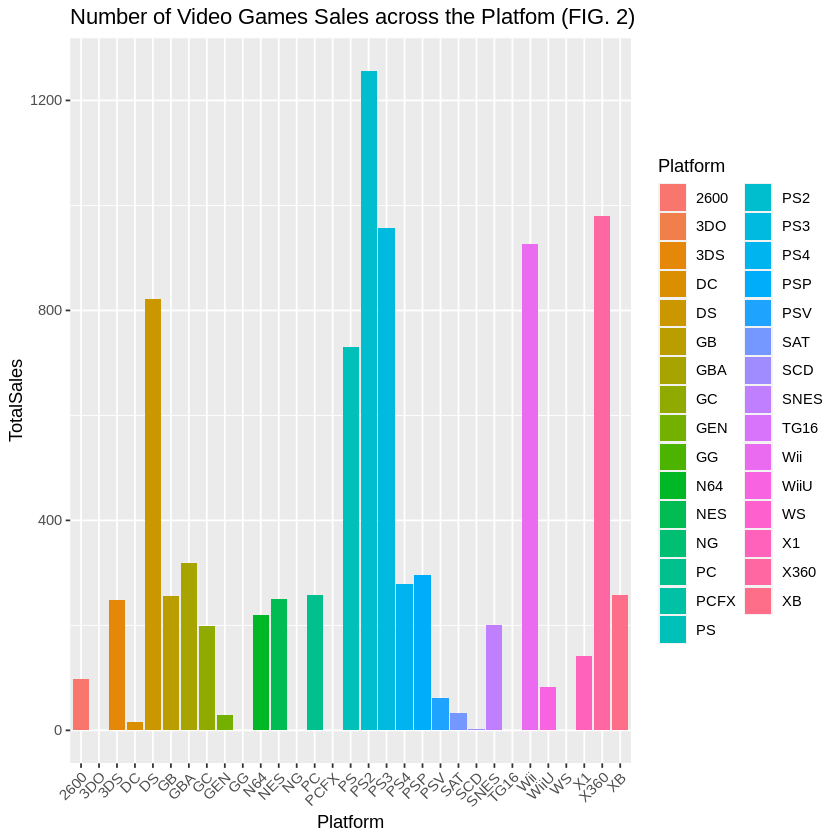

# EDA: Global Video Games Sales

This projects conducts Exploratory Data Analysis on the [Global Video Game Sales Dataset](https://www.kaggle.com/datasets/thedevastator/global-video-game-sales).
This was done using the R programming language.

## Goals

This projects aims to study the following:

- When did video game publications start to rise?
- Which platforms achieved the highest global success?
- Is there a difference in platform preference across the three regions?
- Is there a difference in genre preference across the - three regions?
- Which genres have been consistently popular over time?
- What trends emerge in video game sales across various platforms and genres?
- Can specific factors such as genre diversity or platform type influence a game's success on a global scale?
- Which publishers are the most successful globally?
- What platform was popular each year?

## Findings

### Rise of Video Game Publications

- Game publications started to rise in 1991, reaching a peak in 2009 and has been on a downward trajectory ever since.

### Platforms

- Playstation 2 (PS2) had the highest global sales out of all platforms, followed closely by the Xbox 360 (X360)

- North America favors Xbox consoles, Europe favors Playstation consoles, while Japan favors Nintendo consoles.

### Genres

- North America and Europe tended to prefer similar genres, with Action games being the most bought, whereas Japan favored Role-playing games.

### Publishers

- Nintendo covers the greatest share of sales, with EA and Activision in second and third place respectively.

### PCA

PC1:

- PC1 captures the highest variance and seems to represent how popular a game is worldwide.
- The loadings imply PC1 is positively influenced by sales in North America and Europe, and negatively by sales in Japan.

PC2:

- PC2 depicts a strong negative loading between Japan sales and other regions which highlights Japan's distinctive sales behavior compared to other regions.

PC3:

- PC3 shows loadings in opposite directions between sales in North America and other regions.

## Contributions

Equal contributions from Areeg Elkholy and Mohamed Elsherif
